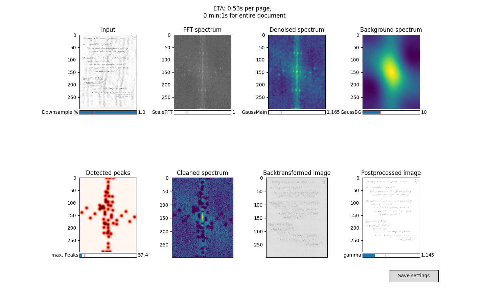

<!--
*** Thanks for checking out the Best-README-Template. If you have a suggestion
*** that would make this better, please fork the repo and create a pull request
*** or simply open an issue with the tag "enhancement".
*** Thanks again! Now go create something AMAZING! :D
***
***
***
*** To avoid retyping too much info. Do a search and replace for the following:
*** japhba, unchecker, twitter_handle, email, unchecker, FFT-based Python application to remove the grid in scanned, handwritten notes. 
-->


<!-- PROJECT SHIELDS -->
<!--
*** I'm using markdown "reference style" links for readability.
*** Reference links are enclosed in brackets [ ] instead of parentheses ( ).
*** See the bottom of this document for the declaration of the reference variables
*** for contributors-url, forks-url, etc. This is an optional, concise syntax you may use.
*** https://www.markdownguide.org/basic-syntax/#reference-style-links
-->
<!--
[![Contributors][contributors-shield]][contributors-url]
[![MIT License][license-shield]][license-url]
-->


<!-- PROJECT LOGO -->
<br />
<p align="center">
  <a href="https://github.com/japhba/unchecker">
  </a>

  <h3 align="center">unchecker</h3>
  
  </p>
</p>




<!-- USAGE EXAMPLES -->
## Usage
Download the script and open a terminal at the location where the script is stored. 
### Open the GUI for parameter adjustment
```
python main.py --input my_griddy_file.pdf --output my_blank_file.pdf
```

### Creating your own benchmark
A benchmark that integrates well with the rest of the package can easily be implemented by inheriting from a base class. For parametric benchmarks, i.e. functions that can be constructed like y=f(x;p), with p a parameter, refer to ```base_parametric_benchmark.py``` and the annotations there. 
For a non-parametric benchmark, e.g. consisting of samples of a Gaussian process, inherit from ```base_benchmark.py```. 


<!-- LICENSE -->
## License

Distributed under the MIT License. 


<!-- CONTACT -->
## Contact

Project Link: [https://github.com/japhba/unchecker](https://github.com/japhba/unchecker)


<!-- MARKDOWN LINKS & IMAGES -->
<!-- https://www.markdownguide.org/basic-syntax/#reference-style-links -->
[contributors-shield]: https://img.shields.io/github/contributors/japhba/repo.svg?style=for-the-badge
[contributors-url]: https://github.com/japhba/repo/graphs/contributors
[forks-shield]: https://img.shields.io/github/forks/japhba/repo.svg?style=for-the-badge
[forks-url]: https://github.com/japhba/repo/network/members
[stars-shield]: https://img.shields.io/github/stars/japhba/repo.svg?style=for-the-badge
[stars-url]: https://github.com/japhba/repo/stargazers
[issues-shield]: https://img.shields.io/github/issues/japhba/repo.svg?style=for-the-badge
[issues-url]: https://github.com/japhba/repo/issues
[license-shield]: https://img.shields.io/github/license/japhba/repo.svg?style=for-the-badge
[license-url]: https://github.com/japhba/repo/blob/master/LICENSE.txt
[linkedin-shield]: https://img.shields.io/badge/-LinkedIn-black.svg?style=for-the-badge&logo=linkedin&colorB=555
[linkedin-url]: https://linkedin.com/in/japhba
